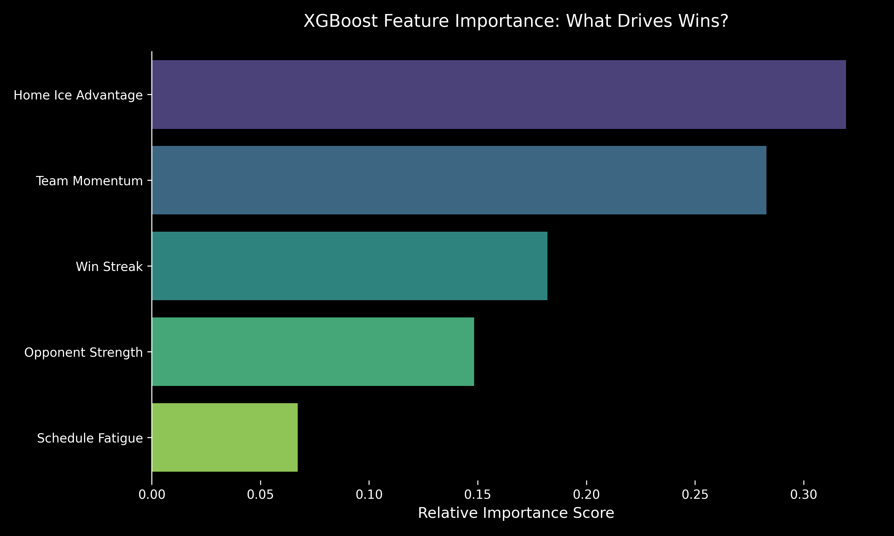

# NHL Momentum Prediction 🏒

**Author:** Brian Fortin

**Date:** November 2025

**Purpose:** Create an end-to-end automated pipeline with custom features to make a model with well-reasoned predictions about game outcome.

---

## Overview

Using the Boston Bruins (2022–2023 and 2023–2024 seasons) as a case study, this pipeline takes in raw game logs from the NHL API, defines performance features, and trains a predictive model to outperform a standard baseline.

This machine-learning project quantifies the impact of team-level variables on NHL game outcomes including *Team Momentum*, *Opponent Strength*, and *Schedule Fatigue*.

---

## Summary
* **Objective:** Predict $P(\text{Win})$ using dynamic features rather than static player stats.
* **Best Model:** XGBoost Classifier (Time-Series Split).
* **Key Result:** Achieved **59.4% Accuracy** (*AUC*: 0.606), outperforming the desired ~55% sports betting baseline.
* **Top Signal:** *Home Ice Advantage* ($0.32$) and *Team Momentum* ($0.28$) are the strongest predictors of game outcome for the Bruins 2023–2024 season.

---

## Pipeline: Data Preparation and Feature Definitions

### 1. ETL (Extract, Transform, Load)
* **Source:** NHL Stats API (`/v1/club-schedule-season`).
* **Processing:** Automated script calls *NHL Stats API* and produces `bruins_data.csv`.
* **Scope:** 2022-2023 and 2023-2024 Seasons.

### 2. Feature Engineering
I created specific explanatory variables to test how game context affects outcome:
* `rolling_goal_diff`: ***Team Momentum*** calculated as a 5-game rolling sum of goal differentials.
* `is_strong_opponent`: ***Opponent Strength*** includes teams that made the playoffs in the 2022–2023 season.
* `is_btb`: ***Schedule Fatigue*** indicator (1 if playing on 0 days of rest, 0 otherwise).
* `win_streak`: ***Win Streak*** cumulatively counts consecutive wins leading into the match.
* `is_home`: ***Home Ice Advantage*** indicator (1 if playing in home arena, 0 otherwise).

---

## Project Hypothesis

The cumulative effect of recent team performance, as measured by ***Team Momentum***, will be the single strongest predictor of a Boston Bruins win, demonstrating a higher feature importance score than static variables like ***Home Ice Advantage*** and ***Win Streak***.

The rationale was that the Bruins are a strong team with a history of winning streaks, and that home ice advantage is often an overestimated factor.

---

## Methodology

To rigorously benchmark performance, I evaluated two modeling strategies, *Logistic Regression* and *XGBoost*, using the **identical feature set defined above**.

**Validation Strategy**
I utilized a **Time-Series Split** (training: 2022-23, testing: 2023-24) to simulate real-world forecasting where future outcomes are unknown.
Unlike using simple random sampling, this approach exposes the model to **concept drift** (i.e., roster turnover between seasons), ensuring the reported accuracy reflects true predictive power rather than just interpolation.

**Why XGBoost?**
*Logistic Regression* has a major caveat: it assumes linear relationships between variables, which is an unrealistic assumption when applied to complex sports data.
For example, a variable such as schedule fatigue may compound exponentially against playoff-level teams.

I selected *XGBoost* because it is a gradient-boosting method that builds a collection of decision trees.
Each tree is trained to correct the residual errors of the previous ones, allowing the model to capture **non-linear interactions** that linear models miss.

**Metric**
The ROC curve plots true positive rate against false positive rate, and its area under the curve (AUC) measures how well the model ranks positive outcomes above negative ones.
An *AUC* of 0.5 indicates random performance, while my score of *0.606* demonstrates predictive skill beyond chance.

All results may be repeated by running the *Jupyter Notebook* file `nhl_momentum_prediction.ipynb`.

---

## Results

### Model Performance Comparison

| Model                   | Accuracy | AUC   | Notes                                                                                                                         |
|:------------------------|:---------|:------|:------------------------------------------------------------------------------------------------------------------------------|
| **Logistic Regression** | 56.4%    | N/A   | Struggled with non-linear relationships.                                                                                      |
| **XGBoost**             | 59.4%    | 0.606 | Tree-based logic successfully modeled non-linear patterns, achieving **3% more accuracy** over the logistic regression model. |

### Feature Importance
The *XGBoost* feature importance analysis revealed that ***Home Ice Advantage*** and ***Team Momentum*** are the primary drivers of win probability.



### Modeling
I compared the *Logistic Regression* (linear baseline) model against the *XGBoost* (gradient-boosted trees) model.
The results demonstrated that game outcomes are affected by non-linear interactions between *Team Momentum*, *Opponent Strength*, and *Schedule Fatigue*, which the linear model failed to fully capture.

### Conclusion

The project results challenged the initial hypothesis. In reality, ***Home Ice Advantage*** (0.32) is the strongest predictor of winning, while ***Team Momentum*** is second (0.28).

1.  **Findings:** ***Home Ice Advantage*** (0.32) and ***Team Momentum*** (0.28) are the two most important predictors for win probability.
2.  **Algorithm Selection Validated:** The 3% increase in model accuracy by the *XGBoost* model over the *Logistic Regression* baseline validates the importance of using non-linear models to capture complex interactions in sports data.
3.  **Future Work:** The remaining margin for better accuracy (40.6%) suggests that a future model should be more specific, possibly incorporating skater and goalie data such as star player play time, shots on goal, et cetera.

---

## Prerequisites
```bash
pip install pandas numpy requests xgboost scikit-learn matplotlib seaborn